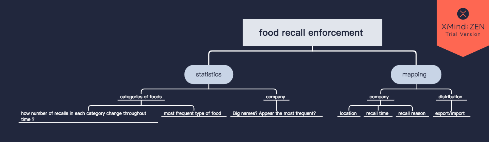
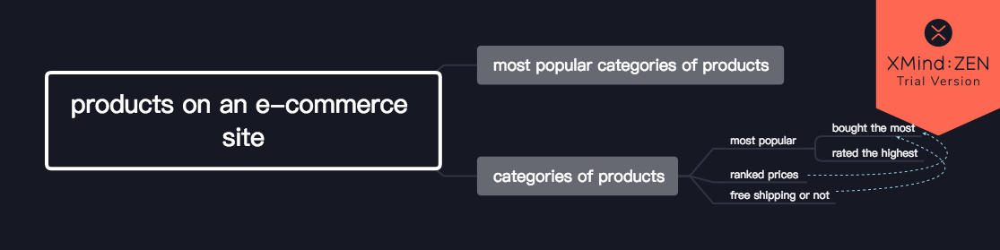

# Topic 1
## I’m visualizing food recall enforcement because I want to show where the unsafe food came from and what kind of food they are in order to inform the public which factories to avoid and let them be cautious in purchasing foods.

[]

On the food side:
what kind of food(classification code)
—statistics on each category
—purchasing pattern (consumer behaviors)

On the production side:
how many units being recalled
location of the factories
time of the enforcement 
company name—viewers won’ t be able to know info on info like financial reports, etc

On the distribution side:
—where did these food go

data source: FDA 

# Topic 2
## I’am visualizing product data for a major e-commerce site because I want to show the what drives potential customers to make a purchase order to show marketing teams the factors they want to consider.

[]

I am breaking down large categories of products:

Within each category of products:

most popular products 
       a.bought the most
       b.rated the highest

2.  assorted by price 
      — in search for relationships between price and purchase 
 
3. free shipping or not
     — in search for relationships between free shipping and purchase

data source: web scrapping 

# Literature Review

### Bibliography
Gesteland, Richard R. Cross-cultural business behavior: negotiating, selling, sourcing and 
managing across cultures. Copenhagen, Denmark: Copenhagen Business School Press, 2005.

Grönroos, Christian. *In search of a new logic for marketing: foundations of contemporary theory*. Hoboken, NJ: Wiley, 2007. 

Moss, Gloria. *Gender, design and marketing: how gender drives our perception of design and marketing*. Farnham: Gower, 2011. 

Wänke, *Michaela. Social psychology of consumer behavior*. New York: Psychology Press, 2015. 
 
