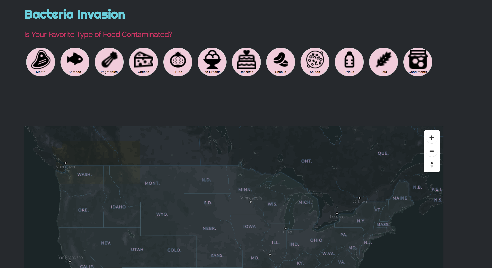

# Bacteria Invasion
## Is Your Favorite Food Contaminated?

### Abstract

Food safety is essential to civilizations. Consumption of bacteria contaminated food could result in various physiological consequneces that are even detrimental. Sadly, there have been over 14,500 recall cases authorized in the United States over the past 7 years, and many of which even have global impact on food that are either imported or exported from all over the world. Moreover, documented by Centers for Disease Control and Prevention, bacteria contamination in food have led to several food borne illness outbreaks. Using data documented by Food and Drug Administration, this research project delves deeper into food safety issues, closely analyzing food recall cases that are associated with bacteria contamination in finding patterns of distributions of questionable food sources as well as disposing "big names" for producing and selling these foods.

[]

# Literature Review

### Bibliography

Sherrow, *Victoria. Food safety*. New York: Chelsea House, 2008. 
 
